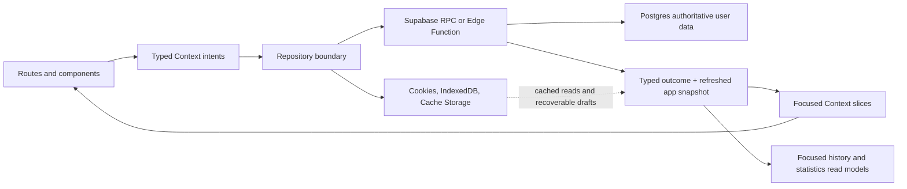

# Calisthenics and Nutrition Coach Engineering Architecture

> **Purpose:** Define the stable client, backend, security, persistence, testing, and delivery standards that every feature must follow.
>
> **Product contract:** [`FEATURES.md`](./FEATURES.md)
> **Design contract:** [`DESIGN.md`](./DESIGN.md)
> **Agent workflow:** [`AGENTS.md`](./AGENTS.md)

## Architecture Baseline

The first release is a single-user, responsive web application backed by
Supabase. The architecture must provide authenticated workout planning, workout
logging, nutrition logging, grocery management, and progress review in browser
viewports from narrow mobile widths through desktop widths. The application may
be installed as a Progressive Web App (PWA), but PWA capabilities are
progressive enhancements rather than requirements for core logging or durable
writes. Supabase is the authoritative source of truth for durable user data in
the MVP. Browser storage may cache read models and preserve recoverable drafts,
but it is not a competing source of truth.

### Current auth-first boundary

The initialized scaffold requires a configured Supabase project and authenticated
identity before product routes are available. The browser/server clients,
session-refresh Proxy, PKCE callback route, auth pages, authenticated RPC
repository, RLS migrations, snapshot hydration, export, deletion, and the
atomic saved-meal logging path are implemented. Browser storage is limited to
recoverable onboarding/session drafts and never replaces Supabase authority.
Trusted production nutrition data, protected AI extraction, and linked remote
smoke verification remain release dependencies.

### Client

- Next.js App Router with the selected current stable Next.js release
- React and React DOM versions supported by that Next.js release
- Strict TypeScript with `typescript`, `@types/node`, `@types/react`, and
  `@types/react-dom`
- ESLint with `eslint` and `eslint-config-next`
- Tailwind CSS with `tailwindcss`, `postcss`, and the compatible PostCSS
  integration (`@tailwindcss/postcss` for Tailwind CSS 4)
- React Context for focused UI-facing application state
- `@supabase/supabase-js` for Supabase access and `@supabase/ssr` for
  request-aware browser/server authentication clients
- `zod` for input, API response, and AI candidate validation at boundaries
- `lucide-react` for accessible web interface icons
- [`@bryllim/workout-guide`](https://www.npmjs.com/package/@bryllim/workout-guide) for framework-neutral exercise metadata and assets
- CSS transitions and Web Animations API for motion, with reduced-motion
  handling; do not add a native animation runtime
- `idb` or an equivalent small IndexedDB wrapper only if recoverable drafts or
  rebuildable read models require a typed browser persistence helper

### Optional PWA and testing packages

- Next.js built-in `src/app/manifest.ts` support for the web app manifest; this
  does not require an additional package. The manifest must define the app
  name, short name, description, `start_url`, standalone display mode, theme
  colors, and installable 192px and 512px icons.
- `@serwist/next` and `serwist` only when service-worker precaching or offline
  navigation is implemented; they must not cache unsaved authenticated
  mutations as if they were persisted
- Vitest, Testing Library, `jsdom`, and Playwright for utility, component, and
  browser-flow verification
- `web-push` only if the later web-push notification feature is implemented;
  keep it server-side and out of the browser bundle

The following native-only dependencies are not part of the Next.js client:
Expo, React Native, NativeWind, React Native Reanimated, Worklets,
`react-native-safe-area-context`, `@expo/vector-icons`, `expo-audio`,
`expo-haptics`, `expo-secure-store`, `expo-sqlite`, native cache modules,
`react-native-svg`, and native Lottie packages. Use semantic HTML, CSS,
browser storage, and web-compatible packages instead.

### Backend

Supabase is required for MVP authentication and durable data. Use the existing
technology choices:

- Supabase Auth for authenticated identity
- Supabase Postgres for durable user data
- Transactional Postgres RPCs for authoritative authenticated mutations
- RLS, explicit grants/revokes, and ownership checks for client-accessible data
- Supabase Edge Functions for AI and other integrations requiring server secrets or orchestration
- pgTAP tests for database security and domain invariants
- Generated TypeScript database contracts in `src/types/database.generated.ts`

AI requests may require a network connection, but manual workout and nutrition
drafts must be preserved across request failures. Always inspect source code,
migrations, and tests before assuming a planned or architecture statement
reflects current implementation.

### Next.js and Supabase session boundary

- Create a browser client with `createBrowserClient` for Client Components and a
  request-scoped server client with `createServerClient` for Server Components,
  Server Actions, and Route Handlers.
- Add the selected Next.js release's `proxy.ts` equivalent at the application
  boundary. Its matcher must refresh expiring Supabase cookies, propagate the
  refreshed cookies to the browser, and apply the cache headers required by
  `@supabase/ssr`.
- Use `supabase.auth.getClaims()` to authorize protected routes, reads, and
  server mutations. Use `getUser()` when a fresh server-confirmed user record
  is required. Do not use an unvalidated `getSession()` result for server-side
  authorization.
- Use the documented PKCE callback flow for browser authentication and keep
  the callback route within the authorized server boundary.
- Authenticated pages, RSC responses, Route Handlers, and Server Action
  responses must not be cached by ISR, a CDN, or a service worker. Use dynamic
  rendering and private/no-store behavior where required so session cookies and
  user data cannot cross accounts.

## Product Architecture and Runtime Data Flow

The application protects this product loop:

1. Set up a profile and goal.
2. Receive an editable weekly workout and meal plan.
3. Complete workouts and log food.
4. Review progress and adjust the next plan.

The authenticated Supabase repository is the primary MVP path. Browser storage
is a read-through cache and draft-recovery mechanism, not an offline authority.



Routes and components express user intent. They do not implement health
calculations, progression rules, nutrition totals, persistence, or durable
mutations. Repositories validate inputs, execute the authenticated Supabase
operation, and return a typed outcome with refreshed state. Browser cache and
draft recovery must never make an unsaved or stale mutation appear persisted.

## Source of Truth and Ownership Rules

| Data kind | Owner | Examples |
|-----------|-------|----------|
| User inputs and preferences | Supabase repository and Postgres | `UserProfile`, unit preference, dietary pattern, equipment |
| Goals and target assumptions | Supabase repository and Postgres | `Goal`, `DailyTarget`, effective date, calculation assumptions |
| Authored catalogs | Versioned constants or trusted catalog read models | `Exercise`, trusted `Food` records |
| Planned prescriptions | Supabase repository and Postgres snapshots | `WorkoutPlan`, `PlannedWorkout`, `PlannedExercise`, `MealPlan`, `PlannedMeal` |
| Actual workout facts | Supabase repository and Postgres history | `WorkoutSession`, `ExerciseLog`, notes, RPE |
| Actual nutrition facts | Supabase repository and Postgres history | `NutritionLog`, serving, source, source version, confidence, date |
| User observations | Supabase repository and Postgres history | `WeightEntry` |
| Grocery state | Supabase repository and Postgres list state | `GroceryList`, `GroceryItem`, checked and edited values |
| Derived domain state | Pure utilities and selectors | BMR, BMI, TDEE, totals, trends, completion status, recommendations |
| Pending AI candidates | Feature-local draft state until confirmation | Extracted foods, matches, assumptions, confidence |
| UI presentation state | Component/route or browser-local cache | Open modal, chart range, active form draft, current tab |
| Server integrations and secrets | Edge Functions or protected services | AI provider, nutrition provider, export/delete orchestration |
| Focused read models | Typed repository services | History pages, statistics, grocery data, account export |

Browser cache is not authoritative. Do not store derived state when it can be
recomputed reliably from durable facts. Do not put presentation-only state or
unconfirmed AI candidates in the durable app snapshot.

### Plan and target versioning

- `UserProfile` stores user inputs and preferences, not derived health values.
- `Goal` and `DailyTarget` retain the assumptions and effective dates used to create a target.
- Updating a target creates a new target version and does not rewrite historical summaries.
- `WorkoutPlan`, `PlannedWorkout`, and `PlannedExercise` represent a versioned prescription.
- Generating or editing a future plan creates a new plan version or immutable snapshot.
- `WorkoutSession` and `ExerciseLog` retain the planned value shown at the time and the actual value recorded by the user.
- Nutrition records retain source, source version, assumptions, confidence, serving units, preparation basis, and date.
- Weight entries retain the original user-entered value and unit; trends do not replace observations.
- Plan regeneration must preserve explicit user substitutions and edits according to a documented merge policy.

## Client Organization

The source layout follows these responsibilities:

```text
src/
├── app/           # App Router layouts, routes, loading/error states, and route handlers
├── proxy.ts       # Supabase session refresh and request-boundary checks
├── components/    # Reusable cross-route UI and meaningful UI behavior
├── constants/     # Exercise/food catalogs, definitions, asset metadata, theme values
├── contexts/      # Focused app-state providers and hooks
├── hooks/         # Shared browser lifecycle or application hooks
├── lib/supabase/  # Browser and request-scoped server Supabase clients
├── services/      # Repositories, AI clients, caches, and domain-facing remote calls
├── styles/        # Global styles and helpers not expressible through utility classes
├── types/         # Domain, backend, generated database, and environment contracts
└── utility/       # Pure calculations, plan rules, validation, and selectors
```

Rules:

- Keep the root `src/app/layout.tsx` focused on metadata, global styles, and
  root providers. Keep route files focused on composition and data boundaries.
- Reusable visual primitives belong in `src/components/`.
- Route-specific composition remains with the route segment.
- Pure calculations and deterministic domain rules belong in `src/utility/`.
- Repository calls, storage access, cache access, AI response parsing, and remote calls belong in `src/services/`.
- Shared contracts belong in `src/types/`.
- Exercise and authored nutrition definitions belong in `src/constants/`.
- Use Server Components for server-owned reads by default and Client
  Components only where browser interactivity or client state is required.
- Use route handlers or Server Actions only as authenticated orchestration
  boundaries; authoritative durable mutations still go through authorized
  Supabase RPCs or Edge Functions.
- Create a new folder or architectural layer only when real behavior requires it.
- Do not add Redux, a second global state library, speculative routing layers, or speculative service layers alongside the existing Context/repository architecture.

## Context and State Management

- Context is the UI-facing state layer. The repository remains the authority for durable mutations and the domain utilities remain the authority for pure rules.
- Keep Context slices focused so unrelated consumers do not rerender for every state change.
- Expose intent-based actions such as `updateProfile`, `updateGoal`, `generateWorkoutPlan`, `editMealPlan`, `completeWorkout`, `saveNutritionEntry`, `updateWeight`, and `updateGroceryList`.
- Routes and components must not calculate BMR, TDEE, macros, nutrition totals, progression, trends, or completion status for persistence.
- Store durable facts such as profile inputs, target versions, plan snapshots, session records, logs, recipes, grocery edits, and weight entries.
- Derive health estimates, totals, progress, trends, and recommendations through pure helpers from durable facts.
- Use functional, immutable state updates.
- Keep active form drafts, selected chart ranges, modal visibility, and open screens out of durable domain state.
- Keep unconfirmed AI extraction results in feature-local draft state. A separate confirmed intent must create a nutrition record.

## Repository Boundary and Supabase Authority

Every durable MVP feature uses the authenticated Supabase path:

1. **Client intent:** a typed Context action validates the shape needed by the screen and sends it to the repository.
2. **Supabase mutation:** the repository calls an authorized Supabase RPC or Edge Function, which validates ownership and domain rules before changing Postgres.
3. **Refreshed state:** the repository returns a typed outcome and refreshed read state; browser cache is updated only after the authoritative response.

For every new durable mutation:

- Add a typed intent to the appropriate Context action contract.
- Add a descriptive mutation ID for in-flight, retry, and error state.
- Validate IDs, ranges, units, date keys, state transitions, and payload shapes before persistence.
- Return a typed domain outcome and refreshed state.
- Update cache behavior deliberately.
- Preserve an idempotency strategy for session completion, nutrition save, plan generation, grocery regeneration, export, and deletion.
- Add repository and RPC parity tests for the same input sequence when more than one implementation exists.
- Define loading, error, offline, retry, and partial-completion behavior.

The MVP must not silently discard a user input because Supabase or an optional
AI service is unavailable. Preserve the active draft, show the mutation as
unsaved, and provide retry behavior. Do not silently queue server mutations
without an explicit synchronization and conflict-resolution design.

## Durable Mutation Standard

A durable mutation must be:

- **Atomic:** related profile, target, plan, log, history, and grocery changes succeed or fail together in one authoritative transaction.
- **Authorized:** authenticated ownership is verified from `auth.uid()`, never from a trusted client user ID.
- **Validated:** units, serving quantities, exercise IDs, dates, ranges, and state transitions are checked at the mutation boundary.
- **Idempotent:** retries cannot duplicate workout sessions, nutrition entries, grocery items, exports, or deletes.
- **Concurrency-safe:** concurrent edits and regeneration cannot silently overwrite user corrections or completed history.
- **Observable:** return stable error codes and log only sanitized failure context.
- **Typed:** keep database contracts and client response contracts synchronized.

Use Postgres transactions or authorized RPCs for related authenticated writes.
Use IndexedDB transactions only for cache and draft-recovery updates. Prefer
natural unique constraints for once-only records where appropriate. Use a
client-generated idempotency key when the same valid intent can be submitted
more than once.

Mutation outcomes that drive UI feedback should expose semantic events, for
example:

```ts
type MutationOutcome = {
  snapshot: AppSnapshot;
  events: Array<
    | { type: "profile-updated" }
    | { type: "target-updated"; targetId: string }
    | { type: "plan-generated"; planId: string }
    | { type: "plan-edited"; planId: string }
    | { type: "workout-completed"; sessionId: string }
    | { type: "nutrition-entry-saved"; entryId: string }
    | { type: "weight-entry-added"; entryId: string }
    | { type: "grocery-list-updated"; listId: string }
  >;
};
```

The exact union should grow only as implemented behavior requires. Components
must not infer business events by comparing arbitrary snapshots.

### MVP-0 concurrency and draft contracts

- Mutable profile, saved-meal, nutrition-log, and grocery-list rows expose an
  integer `revision`. Immutable goal, target, workout-plan, and meal-plan
  snapshots continue to use their existing version numbers.
- Repository intents carry optional `ExpectedVersions`; the authenticated RPC
  preflight locks aggregates in the order idempotency, profile, goal/target,
  workout plan, meal plan, grocery list, then child record. Mismatches return a
  typed `stale_version` detail before domain rows are changed.
- The Context refreshes the authoritative snapshot after a stale result while
  keeping the user draft and retry intent. Reapplication is explicit and uses a
  new idempotency key; an unchanged transport retry reuses the original key.
- `src/services/draftStore.ts` is the single versioned browser draft boundary.
  It uses IndexedDB when available, falls back to user-scoped localStorage,
  expires envelopes by draft type, and clears account drafts on deletion.

Automated target calculations use policy version `calicoach-health-v1`. The
eligibility outcome (`eligible`, `unsupported`, or `not_answered`) and screening
version are stored without sensitive reasons. Unsupported screening outcomes and
raw estimates below the supported calorie floor do not create automated targets.

## Supabase Security and Database Rules

Supabase is the MVP authority for authenticated identity and durable user data.
Apply these rules to every exposed user-data table and every server mutation:

- Treat migrations in `supabase/migrations/` as the schema source of truth. Avoid unreproducible dashboard-only changes.
- Enable RLS on every exposed user-data table.
- Combine `TO authenticated` with an ownership predicate such as `(select auth.uid()) = user_id`.
- Give update policies both `USING` and `WITH CHECK`; updates also require a usable select policy.
- Prefer `SECURITY INVOKER`.
- If `SECURITY DEFINER` is necessary, use an explicit empty or controlled `search_path`, resolve the caller with `auth.uid()`, fully qualify references, and expose only a deliberate authorized wrapper in a non-exposed private schema.
- Do not grant direct client writes that bypass validation for profile targets, plans, workout history, nutrition history, weight entries, grocery state, exports, or deletion workflows.
- Include explicit grants and revokes in every migration.
- Index ownership, date, status, and cursor predicates used by RLS or read models.
- Test cross-user denial, anonymous denial, invalid IDs, duplicate retries, concurrent edits, and direct-table-write denial.
- Regenerate `src/types/database.generated.ts` after schema changes.
- Keep AI and nutrition-provider credentials in server-side secret management only.

Public authored exercise and nutrition catalog data may be readable without
ownership checks when it contains no user data. Custom foods, recipes, logs,
plans, profile data, and weight data remain owner-controlled.

## Supabase Migration Safety

Only perform linked-database changes when explicitly authorized. Before
creating, repairing, or pushing migrations:

1. Inspect `git status --short`, the migration list, and `supabase db push --dry-run`.
2. Compare local migrations with the linked schema, including columns, constraints, indexes, policies, grants, function bodies, and relevant data.
3. If exact equivalence cannot be proven, stop. Do not use blind pulls, force flags, `--include-all`, or guessed repairs.
4. For proven equivalence, record the remote/local versions and evidence, repair history in an auditable order, and rerun the dry run.
5. Push only the verified pending set with explicit authorization for the shared remote.

Never edit, rename, delete, or reorder a migration that may already be applied.
Use a forward migration for corrections.

After a repair or push, verify matching local/remote history, an up-to-date dry
run, deployed RLS and RPC behavior, generated types, local reset behavior, and
the applicable database tests.

## Read Models and Snapshot Size

The main app snapshot should contain only the compact state required to render
the authenticated user's current profile, active targets, current plan, and
today's summary. It should not become an unbounded transport for every
historical record.

Use focused, typed, ownership-checked read models for:

- Statistics by an explicit date range
- Paginated workout and activity history
- Nutrition history and daily summaries
- Exercise and trusted-food catalog data
- Grocery lists and grocery regeneration results
- Account export

Use cursor pagination for growing timelines. Keep predicates index-friendly
and return only fields rendered by the consumer. Calculate averages and trends
with explicit completeness rules so missing or partial nutrition days are not
silently treated as zero intake.

## Cache, Persistence, and Offline Behavior

- Supabase Postgres is the authoritative store for MVP profile, plan, workout, nutrition, grocery, weight, and progress data.
- Use `@supabase/ssr` with secure, appropriately scoped cookies for web session
  material. Do not place refresh tokens or sensitive user data in arbitrary
  browser storage.
- Use IndexedDB for rebuildable read-through data, active drafts, and
  recoverable in-progress session state only. Use Cache Storage or a service
  worker only for public static assets and explicitly safe read models.
- Cached data must never be presented as a confirmed server mutation.
- Cache keys must include the authenticated user identity so data cannot cross accounts or sessions.
- Sign-out and account changes must clear or isolate cached state before another user is shown.
- Cache corruption or version mismatch must fail safely without silently deleting authoritative server data.
- Active workout and nutrition drafts must survive request failure long enough for the user to retry or discard them explicitly.
- If Supabase is unavailable, read the last known cache when safe, disable or label unsaved mutations, and preserve user input.
- AI failure must preserve the user's input and leave manual nutrition logging available.
- Local cache/schema migrations must be versioned, tested, and recoverable.
- A service worker must never replay, queue, or present a durable mutation as
  successful without a confirmed authoritative response. Background sync is
  not part of the MVP unless idempotency and conflict resolution are designed.
- Never precache or serve authenticated HTML, RSC payloads, Route Handler
  responses, Server Action responses, or session-refresh responses through a
  shared service-worker or CDN cache. Authenticated routes must opt out of ISR
  or use private/no-store response behavior as appropriate.
- Export must include the supported user entities, original units, dates, sources, assumptions, and confidence values.
- Delete-account workflows must remove server data through an authorized
  operation and clear all cached browser data for that account.

## Date, Timezone, and Clock Rules

- Store local calendar dates for daily nutrition logs, weight entries, and plan dates as `YYYY-MM-DD` keys.
- Store durable events, workout start/finish times, and edit timestamps as ISO timestamps.
- Use one consistent local or configured timezone when assigning daily logs and calculating daily totals.
- A timezone change must not rewrite historical date keys.
- Consolidate date-key, week-period, and trend-window calculations in shared pure utilities.
- Test DST changes, timezone changes, app background/resume, device clock drift, and actions that cross midnight.
- A workout session must retain its event timestamps and the plan/date context shown when it started.
- Do not mutate or erase durable history in a generic day-rollover action. Derive current summaries from stored facts and the current date.

## UI Events and Navigation

Use one application-level coordinator for transient semantic events such as:

- Plan generated or edited
- Workout completed
- Nutrition entry saved or corrected
- Target updated
- Weight entry added
- Grocery list updated after a plan, recipe, serving, or item edit
- Export completed
- Data deletion completed
- Post-completion navigation

The coordinator owns ordering and dismissal. Presentation components emit
semantic callbacks and do not import unrelated navigation or mutation logic.
Avoid nested modal dialogs and preserve browser focus when dialogs open or
close. Before executing a follow-up action, re-evaluate it against the latest
snapshot when another mutation may have changed its validity.

The initial App Router navigation model is onboarding followed by the product
areas defined in `FEATURES.md`: Home, Workouts, Nutrition, Grocery, Progress,
and Settings. Keep navigation compact, provide usable keyboard and touch
targets, and ensure the workout logger remains usable with one hand and minimal
screen reading.

## AI and External Integrations

- Provider secrets belong in Supabase Edge Functions or another server-side
  secret manager, never in `NEXT_PUBLIC_*`.
- The Next.js browser client must call a protected application endpoint, not an
  AI or nutrition provider directly.
- The nutrition AI endpoint accepts user text only after an explicit user action and returns schema-validated food candidates, quantities, units, preparation details, and uncertainties.
- Trusted nutrition records and deterministic application code own nutrition calculations; model-generated nutrition numbers are never authoritative.
- The endpoint must return matches, assumptions, serving sizes, and confidence in a form the user can review and correct.
- AI output must remain a draft until the user confirms it through a separate nutrition-save mutation.
- Restaurant meals, sauces, cooking oils, and mixed dishes must remain visibly uncertain and must not display false precision.
- Do not send complete profiles, full histories, credentials, or unrelated user data to the model. Send only the minimum context required for the requested extraction.
- Define request timeouts, rate limits, sanitized error logging, provider failure behavior, and data retention before enabling the integration.
- Photo recognition, voice input, social-media extraction, and other later features must not become implicit dependencies of text meal logging.
- Manual nutrition input must remain available as a recoverable draft when offline or when the AI/provider is unavailable; saving it requires a confirmed server mutation.

## Styling and Design System

- Use Tailwind CSS utility classes and shared CSS variables for normal styling.
- Keep shared colors, spacing, radii, typography, and effects in the web design
  tokens used by `src/app/globals.css` and shared component styles.
- Avoid scattered duplicate hex values and arbitrary dimensions.
- Keep narrow layouts compact, scannable, and touch-friendly while allowing
  desktop layouts to use the available space intentionally.
- Make workout controls prominent and usable during exercise without excessive
  reading or navigation.
- Use stable dimensions for timers, status labels, tab items, charts, and
  changing numeric values.
- Use semantic HTML, responsive containers, and browser scrolling instead of
  framework-specific scroll containers or safe-area components.

## Accessibility and Motion

- Every interactive icon has an accessibility role, concise label, disabled state, and at least a 44x44 effective touch target.
- Meaningful images have accessible descriptions; decorative images are hidden from accessibility.
- Status is never communicated with color alone.
- Charts include textual summaries and accessible values.
- Numeric timers and counters use tabular numerals.
- CSS and Web Animations effects should prefer `transform` and `opacity` over
  layout properties.
- Ambient, repeated, entering, and confirmation animations respect the system reduced-motion preference.
- Loading, empty, error, offline, permission-denied, and retry states are required feature states.

## Art, Audio, and Assets

- Keep reusable web assets in `public/` or register their metadata in
  `src/constants/` when they need typed application configuration.
- Use standard web asset URLs or imports; do not repeat native `require()` calls
  across routes.
- Use audio, vibration, and notification APIs only as optional progressive
  enhancements; they must not be required for workout or logging completion.
- Defer non-critical charts, catalog, illustration, audio, and animation assets until their surface mounts.
- Asset optimization must preserve the intended visual style and be measured against a recorded bundle baseline.

## TypeScript, Naming, and Comments

- TypeScript remains strict; avoid `any`.
- Shared domain contracts belong in `src/types/`.
- Use `import type` for type-only imports.
- Use PascalCase for React components, camelCase for values/functions, and descriptive union IDs.
- Use `.tsx` only for files containing JSX and `.ts` for TypeScript logic.
- Keep components focused and avoid unnecessary view wrappers.
- Extract shared behavior when it is reused or owns a meaningful independent responsibility.
- Prefer small pure helpers and readable names.

Comments are required for non-obvious invariants and platform constraints,
including:

- Plan versioning and planned-versus-actual history
- Idempotency and retry assumptions
- Nutrition serving and raw/cooked unit assumptions
- Timezone and local-date boundaries
- RLS or `SECURITY DEFINER` assumptions
- Browser cache, cookie, and local-storage behavior
- AI confirmation and privacy constraints
- Animation cancellation or reduced-motion behavior

Comments should explain why the constraint exists and what would break if it
were removed. Do not restate self-explanatory code.

## Next.js Dependency Rules

- Keep `next`, `react`, and `react-dom` on a version-compatible release set.
- Use `@supabase/ssr` for request-aware server/browser clients and follow the
  selected Next.js release's App Router authentication conventions.
- Use Tailwind CSS and its compatible PostCSS integration; do not reintroduce a
  native styling transform.
- Use `@serwist/next` with `serwist` only when the PWA service-worker
  requirement is actually implemented. Next.js manifest support alone does not
  require Serwist.
- Keep browser-only APIs out of Server Components and server-only secrets out
  of Client Components.
- Prefer the package manager's normal install/update workflow and preserve the
  lockfile once a project manifest exists.
- Do not use `--force` or `--legacy-peer-deps` as a routine peer-dependency fix.
- Re-test both `next dev` and a production `next build` after dependency or
  configuration changes.

## Environment and Secret Management

- The MVP requires the client-safe Supabase URL and publishable key configuration to authenticate and access authorized services.
- Local development uses `.env.local`; commit only `.env.example`.
- The canonical client variables are `NEXT_PUBLIC_SUPABASE_URL` and
  `NEXT_PUBLIC_SUPABASE_PUBLISHABLE_KEY`.
- Only publishable/client-safe values may use `NEXT_PUBLIC_*`.
- Store AI-provider, nutrition-provider, service-role, database, OAuth, push,
  and webhook secrets in Supabase Edge Functions or another server-side secret
  manager.
- Maintain separate development, staging, and production backend configuration before public launch.
- Keep OAuth redirect allow-lists explicit for the supported authentication environments.
- Deploy backward-compatible server changes before clients that require them.
- Do not log meal text, allergy details, health metrics, access tokens, or other sensitive user data unnecessarily.

## Verification Strategy

Use the narrowest relevant verification and expand it with risk:

The Next.js package scripts are available in `package.json`. Supabase-specific
checks apply when migrations and the local database workflow are added.

### Every code change

1. Run `npm run typecheck`.
2. Exercise the affected route at narrow mobile and desktop browser viewports.
3. Verify loading, error, disabled, empty, offline, and retry states where applicable.
4. Confirm text and controls do not overlap at larger font sizes.
5. Confirm keyboard navigation, focus behavior, responsive controls, and one-handed use remain usable.
6. Confirm accessibility roles, labels, touch targets, and reduced-motion behavior.

### Profile, goals, and health calculations

1. Verify metric and imperial input/output conversions.
2. Verify supported input boundaries and invalid values.
3. Verify calculation assumptions, target versions, and estimate/disclaimer copy.
4. Verify aggressive-target and unsupported-population handling.
5. Verify edits recalculate future targets without rewriting historical summaries.

### Plan generation and progression

1. Verify new-user state and deterministic output for the same inputs.
2. Verify equipment, training days, experience, and duration constraints.
3. Verify warm-up, rest, cooldown, regressions, progressions, and recovery boundaries.
4. Verify progression and regression thresholds using recorded RPE or difficulty.
5. Verify user overrides and substitutions survive regeneration.
6. Verify plan edits do not change completed history.

### Workout logging

1. Verify start, pause, resume, finish, skip, modification, substitution, and note flows.
2. Verify planned and actual values remain separate.
3. Verify duplicate completion and interrupted-session behavior.
4. Verify actual reps, holds, durations, load, and RPE are validated and retained.

### Nutrition, recipes, grocery, and AI

1. Verify manual food, custom food, saved meal, recipe, serving, correction, deletion, and duplicate-entry behavior.
2. Verify raw/cooked or other serving assumptions are visible and consistently calculated.
3. Verify estimated and user-provided values remain distinguishable.
4. Verify daily totals use the correct local date and do not treat missing data as zero.
5. Verify AI output is schema-validated, matched to trusted records, uncertain when appropriate, and confirmed before saving.
6. Verify AI/provider failure leaves manual logging available and does not lose user input.
7. Verify grocery regeneration preserves explicit edits and checked-state behavior according to the documented policy.

### Local persistence and account/data controls

1. Verify authenticated data survives browser restart and safe cache/schema migrations.
2. Verify reset-plan retains history.
3. Verify export contains the supported entities, original units, dates, sources, assumptions, and confidence values.
4. Verify account deletion removes server data through the authorized workflow and clears cached browser data.
5. Verify cache corruption, storage failure, network failure, and insufficient-permission states fail safely without silent data loss.

### Supabase changes

1. Reset/apply migrations locally.
2. Run database lint and pgTAP/RLS tests.
3. Verify cross-user and anonymous denial.
4. Regenerate database types.
5. Run TypeScript verification against generated contracts.
6. Review grants/revokes, RLS, indexes, idempotency, and migration ordering.

### Dependency or web-platform changes

1. Run `npm install` or the repository's package-manager equivalent and review the lockfile.
2. Run `npm run typecheck`, lint, and the relevant unit/component tests.
3. Run a production `next build`.
4. Verify the affected route in narrow and wide browser viewports.
5. If PWA behavior changed, verify the manifest, HTTPS/service-worker behavior,
   installability, cache invalidation, and failure behavior in a production-like
   browser session.

## Definition of Done

A feature is complete only when all applicable conditions are met:

1. Product behavior, edge cases, safety copy, uncertainty, and interaction copy are documented.
2. Supabase is the authoritative MVP path; network failures preserve drafts and never misrepresent unsaved mutations.
3. Durable mutations are atomic, authorized, validated, concurrency-safe, and retry-safe.
4. Plan versions and historical logs preserve what was prescribed and what actually happened.
5. Cache and offline behavior are explicit and never misrepresent unsynchronized data.
6. Shared behavior is implemented through focused components, utilities, repositories, and services.
7. Accessibility, reduced motion, large text, keyboard input, responsive behavior, and narrow-screen overflow are verified.
8. Pure calculations, repositories, critical component states, and the primary user flow have appropriate tests.
9. TypeScript, Next.js build checks, Supabase tests, and browser checks pass as applicable.
10. `FEATURES.md`, `ARCHITECTURE.md`, `DESIGN.md`, and `AGENTS.md` remain consistent with implemented behavior.

## Documentation Ownership

- This file owns stable client architecture, state/data ownership, security, persistence, testing, and delivery standards.
- [`FEATURES.md`](./FEATURES.md) owns product goals, feature scope, UX behavior, navigation, data-model expectations, and MVP acceptance criteria.
- [`DESIGN.md`](./DESIGN.md) owns current visual/design decisions, design tokens, UX patterns, responsive/navigation model, and auth-first setup.
- [`AGENTS.md`](./AGENTS.md) owns mandatory agent workflow, task routing, product guardrails, engineering guardrails, and verification requirements.
- Source code, tests, migrations, generated types, and deployed configuration remain the final truth for current implementation behavior.
